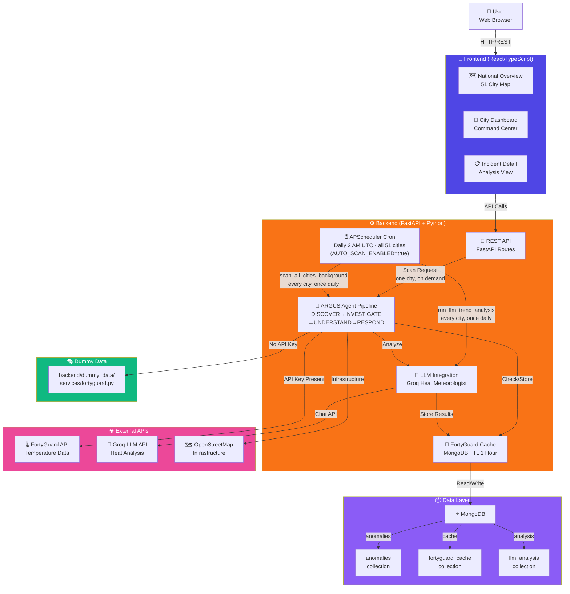
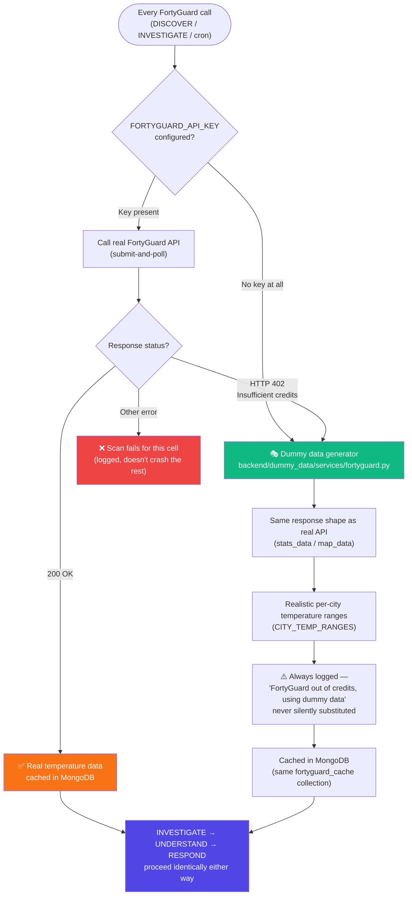
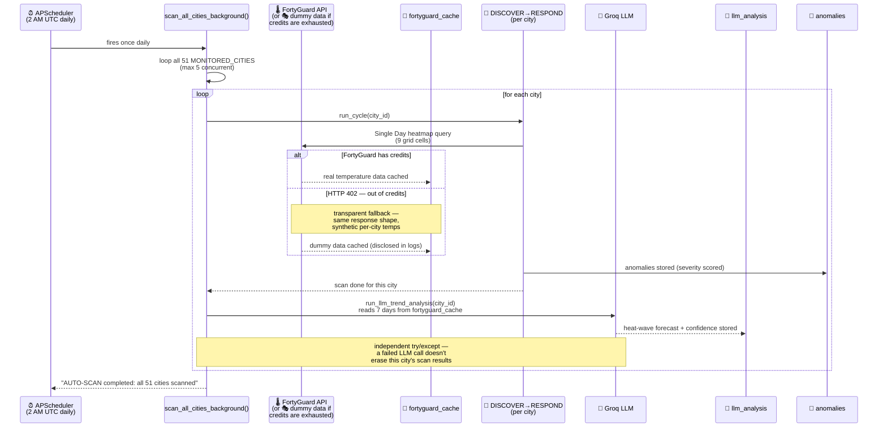

# 🔥 ARGUS — Autonomous Urban Heat Intelligence System

**Real-time thermal risk detection across all 51 US states + DC, powered by AI and FortyGuard Temperature API.**

Discovers thermal risks before humans know where to look, investigates why they matter, and recommends what cities should do next.

Four-stage agent loop: **DISCOVER → INVESTIGATE → UNDERSTAND → RESPOND**

---

## 🏗️ High-Level Architecture



---

## 📂 Complete Repository Structure

### **Backend Structure** (`/backend`)

```
backend/
│
├── argus_agent/                           # Core application package
│   ├── src/
│   │   ├── api/
│   │   │   └── routes.py                  # FastAPI routes: /api/cities, /api/anomalies, /api/agent/scan
│   │   │
│   │   ├── services/
│   │   │   ├── fortyguard_client.py       # Async FortyGuard API client (submit-and-poll pattern)
│   │   │   │                               # Uses dummy data when FORTYGUARD_API_KEY not set
│   │   │   ├── reasoner_service.py        # Groq LLM interface for RESPOND stage
│   │   │   ├── agent_engine.py            # 4-stage pipeline: DISCOVER→INVESTIGATE→UNDERSTAND→RESPOND
│   │   │   └── llm_prompts.py             # ⭐ Prompt templates (NOT in DB, versioned in code)
│   │   │
│   │   ├── db/
│   │   │   ├── mongo.py                   # MongoDB client, collections, TTL indexes
│   │   │   └── models.py                  # Pydantic schemas: AnomalyDocument, FortyGuardCacheEntry, LLMAnalysisDocument
│   │   │
│   │   ├── utils/
│   │   │   └── units.py                   # Temperature conversion (°C ↔ °F)
│   │   │
│   │   ├── constants.py                   # 📋 CONFIG HUB: MONITORED_CITIES (51), CITY_TEMP_RANGES, rate limits
│   │   ├── config.py                      # Environment variables (GROQ_API_KEY, MONGO_URI, etc.)
│   │   └── logging/
│   │       └── app_logger.py              # Logging configuration
│   │
│   └── main.py                             # 🚀 FastAPI app entry point + APScheduler for cron jobs
│
├── dummy_data/                             # ⭐ Isolated dummy data generation (zero credits)
│   ├── services/
│   │   └── fortyguard.py                  # Generates realistic FortyGuard responses
│   │                                       # - generate_tcm_response() → 9-cell temps
│   │                                       # - generate_exceedance_response() → hours above threshold
│   │                                       # - generate_persistence_response() → consecutive hot hours
│   │
│   └── __init__.py
│
├── scripts/                                 # Data population & analysis scripts
│   ├── populate_7day_historical_data.py   # Backdate 8 days of cache entries (for trend analysis)
│   ├── generate_sample_llm_analyses.py    # Generate Groq LLM analyses (5 cities, ~30 seconds)
│   └── generate_llm_trend_analyses.py     # Generate LLM analyses (51 cities, slower due to rate limit)
│
├── requirements.txt                        # Python dependencies
├── .env.example                            # Environment template
└── logs/                                   # Application logs

```

### **Frontend Structure** (`/frontend`)

```
frontend/
│
├── src/
│   ├── pages/
│   │   ├── Dashboard.tsx                  # 🎯 City Command Center (main view)
│   │   │                                   # Shows: stats header, temperature grid, 7-day trends
│   │   │                                   # Shows: LLM forecast card, anomalies, agent feed
│   │   │
│   │   └── Incident.tsx                   # 📋 Anomaly detail page
│   │
│   ├── components/
│   │   ├── dashboard/
│   │   │   ├── CityStatsHeader.tsx        # 📊 Enhanced header with live metrics
│   │   │   │                               # • Current temp + trend
│   │   │   │                               # • Anomaly count
│   │   │   │                               # • Data coverage %
│   │   │   │                               # • Risk zones
│   │   │   │
│   │   │   ├── CityTemperatureMap.tsx     # 🗺️ 9-cell grid heatmap visualization
│   │   │   │                               # Color-coded: blue (cool) → red (hot)
│   │   │   │
│   │   │   ├── TemperatureTrendChart.tsx  # 📈 7-day temperature trend (Recharts)
│   │   │   │                               # Shows: min/max/mean temps + trend analysis
│   │   │   │
│   │   │   ├── LLMForecastCard.tsx        # 🔥 ⭐ NEW: Groq LLM heat analysis
│   │   │   │                               # Shows: heat wave status, trend, confidence score
│   │   │   │
│   │   │   ├── CityInfoCard.tsx           # 📌 City info (for maps/tooltips)
│   │   │   │
│   │   │   ├── MetricsPanel.tsx           # 📊 Anomaly summary stats
│   │   │   ├── CityGrid.tsx               # 📍 Anomalies in grid layout
│   │   │   ├── AgentFeed.tsx              # 🤖 Agent reasoning output
│   │   │   ├── AnomalyQueue.tsx           # 📋 Detailed anomaly list
│   │   │   └── QueryPanel.tsx             # 🔍 Custom FortyGuard query builder
│   │   │
│   │   ├── layout/
│   │   │   ├── Header.tsx                 # Top navigation
│   │   │   └── Sidebar.tsx                # Left sidebar (if applicable)
│   │   │
│   │   └── common/
│   │       └── LoadingSpinner.tsx         # ⏳ Loading indicator
│   │
│   ├── hooks/
│   │   ├── useAnomalies.ts                # Fetch anomalies with polling
│   │   ├── usePolling.ts                  # Generic polling hook
│   │   └── useTemperatureData.ts          # Fetch daily temperature stats
│   │
│   ├── api/
│   │   └── client.ts                      # API client (fetch wrapper)
│   │
│   ├── types/
│   │   └── index.ts                       # TypeScript interfaces
│   │
│   └── App.tsx                             # Main app router
│
├── public/
│   ├── index.html
│   └── favicon                             # 🔴 Red "A" gradient icon
│
├── package.json
└── vite.config.ts                          # Vite config (proxies /api to :8000)

```

---

## 🔄 When & Why Dummy Data is Used

Two independent triggers fall back to the same dummy-data generator — one checked once at
startup, the other checked on every single FortyGuard call:



**Path 1 — no key configured at all** (typical for a zero-credit demo setup, checked once):
every call skips FortyGuard entirely. **Path 2 — key configured but credits ran out mid-scan**
(the more common case once you're actively scanning — a single 9-cell city scan can cost
1,000+ credits): `fortyguard_client.py::_submit_and_wait` catches the `HTTP 402` per-call, so one
city running low doesn't take down the other 50 in a cron run. Either path, the rest of the
DISCOVER→RESPOND pipeline — anomaly scoring, the live map, the AI forecast — runs identically,
because the dummy response is structurally indistinguishable from a real one.

**Use Case: Zero-Credit Demo Setup**
```bash
# Leave FORTYGUARD_API_KEY blank in .env
GROQ_API_KEY=xxxx
FORTYGUARD_API_KEY=          # ← Leave blank!
MONGO_URI=mongodb+srv://...

# Backend automatically uses dummy data
python scripts/populate_7day_historical_data.py  # Populate cache
npm run dev                                       # Dashboard shows full 7-day trends!
```

**Production Setup**
```bash
# Set real API key in .env
FORTYGUARD_API_KEY=xxxxx  # ← Real key
# System automatically switches to real API
# All other code unchanged ✅
```

**A second, more common trigger: mid-scan credit exhaustion.** Even with a real key configured,
FortyGuard bills per grid cell — a full 9-cell city scan can cost 1,000+ credits, and scanning
all 51 cities daily (via the cron job above) burns through a free-tier key fast. When FortyGuard
responds `HTTP 402 Insufficient credits`, `fortyguard_client.py::_submit_and_wait` catches that
specific error and falls back to the same dummy-data generator — per-call, not globally — so one
city running low on credits doesn't take down the other 50. This is always logged
(`"FortyGuard out of credits, using dummy data"`), never silently substituted.

---

## 🚀 Data Flow Diagram

```mermaid
graph LR
    User["👤 User<br/>Click 'Run Scan Now'"]
    
    User -->|POST /api/agent/scan| FastAPI["⚙️ FastAPI Route"]
    
    FastAPI -->|Call agent_engine.py| DISCOVER["🔍 DISCOVER<br/>Scan 9 cells"]
    
    DISCOVER -->|Check API key| KeyCheck{"API Key<br/>Set?"}
    
    KeyCheck -->|YES| FG["🌡️ FortyGuard API<br/>Real Temperature"]
    KeyCheck -->|NO| Dummy["🎭 Dummy Data<br/>Synthetic Temps"]
    
    FG -->|Submit + Poll| Cache1["💾 MongoDB Cache<br/>fortyguard_cache"]
    Dummy -->|Generate| Cache1
    
    Cache1 -->|Store results| INVESTIGATE["🔎 INVESTIGATE<br/>Deep metrics"]
    
    INVESTIGATE -->|Analyze signals| UNDERSTAND["🧠 UNDERSTAND<br/>Anomaly scoring"]
    
    UNDERSTAND -->|Identify risks| RESPOND["💬 RESPOND<br/>Call Groq LLM"]
    
    RESPOND -->|Generate analysis| LLMCache["💾 MongoDB<br/>llm_analysis"]
    
    LLMCache -->|Store anomaly| Anomalies["💾 MongoDB<br/>anomalies"]
    
    Anomalies -->|Return to frontend| User
    
    style FastAPI fill:#f97316,color:#fff
    style DISCOVER fill:#f97316,color:#fff
    style INVESTIGATE fill:#f97316,color:#fff
    style UNDERSTAND fill:#f97316,color:#fff
    style RESPOND fill:#f97316,color:#fff
    style FG fill:#ec4899,color:#fff
    style Dummy fill:#10b981,color:#fff
    style Cache1 fill:#8b5cf6,color:#fff
    style LLMCache fill:#8b5cf6,color:#fff
    style Anomalies fill:#8b5cf6,color:#fff
```



---

## ⏰ Cron Job vs. Manual Scan — What Runs When

ARGUS has two independent ways to trigger a scan, and they're **not** distinguished by time
window (both use FortyGuard's Single Day analytic type — see note below) — they're
distinguished by *what triggers them* and *what they do afterward*:

| | **Manual "Run Scan Now"** | **Daily Cron (Auto-Scan)** |
|---|---|---|
| Trigger | User clicks a button, one city at a time | APScheduler, 2 AM UTC, all 51 cities |
| Credit spend | Only what the user explicitly asks for | Bounded — 5 cities concurrently, all 51 daily |
| After scanning | Just returns anomalies to the dashboard | **Also** runs a Groq trend analysis per city |
| Enabled by | Always available | `AUTO_SCAN_ENABLED=true` env var |

> **Why not a "live single-hour" mode for manual scans?** We tested this — FortyGuard's Single
> Hour analytic type frequently misses the satellite pass and returns `n_cells: 0` even when the
> date/hour are correctly aligned. A full-day mean is far more likely to have real coverage, so
> both manual and cron scans deliberately use **Single Day** (see
> `agent_engine.py::_read_zone_temperature`). "Manual" here means *on-demand*, not *shorter time
> window* — the real-time part is that it's user-triggered right now, not that it queries a
> narrower slice of the day.

### One cron run, two datasets refreshed



**Why dummy data instead of failing the scan?** FortyGuard bills per grid cell, and a single
9-cell city scan can cost 1,000+ credits — across 51 cities daily, a free-tier key runs out fast
(`HTTP 402 Insufficient credits`). Rather than crash the cron mid-run, `fortyguard_client.py`
catches that specific error and swaps in a structurally identical synthetic response (same
`stats_data`/`map_data` shape, realistic per-city temperature ranges) — so the pipeline, the
dashboard, and the LLM analysis all keep working end-to-end. This is always visible in the logs
(`"FortyGuard out of credits, using dummy data"`) — never silently presented as real.

**Location**: `backend/argus_agent/main.py` (scheduler + cron function),
`backend/argus_agent/src/api/routes.py::run_llm_trend_analysis` (shared LLM logic — also used by
the dashboard's on-demand "Refresh Analysis" button)

```python
# main.py
async def scan_all_cities_background() -> None:
    for city_id in city_ids:                                  # max 5 concurrent
        documents, meta = await argus_agent.run_cycle(collection, city_id)   # -> fortyguard_cache + anomalies
        await run_llm_trend_analysis(city_id, days=7)                       # -> llm_analysis

@asynccontextmanager
async def lifespan(app: FastAPI):
    if os.getenv("AUTO_SCAN_ENABLED") == "true":
        scheduler.add_job(scan_all_cities_background, "cron", hour=2, minute=0)
        scheduler.start()
```

**Enable in Production**
```bash
export AUTO_SCAN_ENABLED=true
# Backend will now scan all 51 cities AND refresh their AI forecasts daily at 2 AM UTC
```

---

## 🎯 API Endpoints Reference

| Endpoint | Method | Purpose |
|----------|--------|---------|
| `/api/cities` | GET | All 51 cities + anomaly counts |
| `/api/agent/scan?city_id=...` | POST | Trigger DISCOVER→RESPOND for one city |
| `/api/anomalies?city_id=...` | GET | List thermal anomalies |
| `/api/anomalies/{id}` | GET | Anomaly detail + analysis |
| `/api/cities/{city_id}/daily-temperatures?days=7` | GET | 7-day temperature history |
| `/api/cities/{city_id}/llm-trend-analysis?days=7` | POST | Groq LLM forecast + confidence |

---

## 🎨 Dashboard Components (Top to Bottom)

```
┌─────────────────────────────────────────────────────────┐
│ CityStatsHeader                                         │
│ • City name + severity badge (CRITICAL/HIGH/etc)      │
│ • Current temp with trend (📈📉➡️)                       │
│ • Anomalies, data coverage, risk zones                │
└─────────────────────────────────────────────────────────┘
              ↓
┌─────────────────────────────────────────────────────────┐
│ QueryPanel (custom FortyGuard query builder)           │
└─────────────────────────────────────────────────────────┘
              ↓
┌──────────────────────┐  ┌─────────────────────────────┐
│ Run Scan Button      │  │ Last Scan Summary           │
└──────────────────────┘  └─────────────────────────────┘
              ↓
┌─────────────────────────────────────────────────────────┐
│ MetricsPanel (anomaly statistics)                      │
└─────────────────────────────────────────────────────────┘
              ↓
┌─────────────────────────────────────────────────────────┐
│ CityTemperatureMap (9-cell grid heatmap)               │
│ Blue (cool) ─────────────► Red (hot)                   │
└─────────────────────────────────────────────────────────┘
              ↓
┌─────────────────────────────────────────────────────────┐
│ TemperatureTrendChart (7-day history with Recharts)    │
│ Shows: min/max/mean + trend (Worsening/Stable/Better)  │
└─────────────────────────────────────────────────────────┘
              ↓
┌─────────────────────────────────────────────────────────┐
│ LLMForecastCard ⭐ (Groq heat wave analysis)           │
│ • Heat wave status (YES/NO)                            │
│ • Trend (Worsening/Stable/Improving)                   │
│ • Confidence score (0-100%)                            │
│ • Color-coded by confidence                            │
└─────────────────────────────────────────────────────────┘
              ↓
┌──────────────────────────┐  ┌───────────────────────┐
│ CityGrid (anomalies)    │  │ AgentFeed (reasoning) │
└──────────────────────────┘  └───────────────────────┘
              ↓
┌─────────────────────────────────────────────────────────┐
│ AnomalyQueue (detailed list + RESPOND actions)         │
└─────────────────────────────────────────────────────────┘
```

---

## ⚙️ Configuration Reference

**Environment Variables** (`.env`):
```bash
GROQ_API_KEY=gsk_...               # Required: Groq API key
FORTYGUARD_API_KEY=                # Optional: blank = dummy data
MONGO_URI=mongodb+srv://user:pass  # Required: MongoDB connection
AUTO_SCAN_ENABLED=false            # Optional: enable daily scans
```

**Code Configuration** (`argus_agent/src/constants.py`):
```python
MONITORED_CITIES = [...]           # 51 US cities (state capitals, major cities)
CITY_TEMP_RANGES = {...}           # Realistic min/max temps per city
FORTYGUARD_MAX_CONCURRENT_REQUESTS = 4     # Rate limiting semaphore
FORTYGUARD_CACHE_TTL_SECONDS = 3600        # 1-hour cache expiration
FORTYGUARD_DATA_LAG_DAYS = 1               # Account for FortyGuard data lag
```

---

## 🚀 Quick Start Commands

```bash
# Setup Backend
cd backend
python3 -m venv .venv
source .venv/bin/activate
uv pip install -r requirements.txt
cp .env.example .env
# Edit .env with API keys

# Populate historical data (for 7-day trends)
python scripts/populate_7day_historical_data.py

# Start backend
.venv/bin/python -m uvicorn argus_agent.main:app --reload

# In another terminal: Setup Frontend
cd frontend
npm install
npm run dev

# Navigate to http://localhost:5173
```

---

## 📊 Key Metrics

- **Coverage**: 51 US cities (1 per state + DC)
- **Grid Resolution**: 9-cell per city (3×3 grid)
- **Cache TTL**: 1 hour (auto-eviction)
- **Rate Limit**: 4 concurrent FortyGuard requests
- **LLM Model**: Groq `openai/gpt-oss-120b` (heat meteorologist)
- **Cron Schedule**: Daily 2 AM UTC (optional, production only)
- **Demo Mode**: Fully functional with zero credits

---

## 🎬 Demo vs Production

| Aspect | Demo Mode | Production |
|--------|-----------|-----------|
| API Key Required | ❌ No | ✅ Yes |
| Data Source | 🎭 Dummy | 🌡️ Real |
| Credits Used | 💰 $0 | 💰 Per API call |
| Data Quality | ✅ Realistic | ✅ Real |
| Perfect For | 🎬 Videos, testing | 🏢 Real deployments |
| Switch Method | Add API key to `.env` | No code changes |

---

See `RESTRUCTURING_SUMMARY.md` for code reorganization details.
